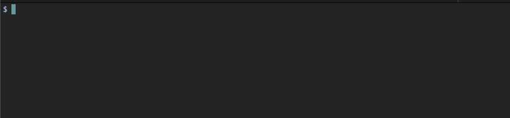

# Dye 

`dye` is a tool to easily color text in shell.

# Usage

See the gif below to see these commands in action.

    echo $(dye --red WARN) This tool will knock your socks off.
    
    echo $(dye -r WARN) It takes too many characters to type --red, so every display modifier has a shortcode.
    
    echo $(dye -cl INFO) If your shell supports it, this label will be *blinking*. How cool is that?
    
    echo $(dye --cyan INFO) Lowercase letter options modify the text, uppercase modifies the $(dye -R --black background).
    
    echo $(dye -g SUCCESS) You are a $(dye -u great) engineer for using tools that make your life simpler and easier.

# Installation

    cargo install dye-cli

# Documentation

The `--help` option gives you all you need to know. Lowercase short options affect foreground color and style, and 
uppercase short options affect the background.

    Add color to text. Pass text as arguments (like the echo command), or pass no arguments to read
    stdin.

    USAGE:
        dye [OPTIONS] [string]...

    OPTIONS:
        -b, --blue         Set foreground blue
        -B, --bgblue       Set background blue
        -c, --cyan         Set foreground cyan
        -C, --bgcyan       Set background cyan
        -d, --bold         Add bold style
        -g, --green        Set foreground green
        -G, --bggreen      Set background green
        -h, --help         Print help information
        -i, --italic       Add italic style
        -k, --black        Set foreground black
        -K, --bgblack      Set background black
        -l, --blink        Add blink style
        -m, --dimmed       Add dimmed style
        -p, --purple       Set foreground purple
        -P, --bgpurple     Set background purple
        -r, --red          Set foreground red
        -R, --bgred        Set background red
        -u, --underline    Add underline style
        -v, --reversed     Add reversed style
        -V, --version      Print version information
        -w, --white        Set foreground white
        -W, --bgwhite      Set background white
        -y, --yellow       Set foreground yellow
        -Y, --bgyellow     Set background yellow

# Contributing

Contributions are what make the open source community such an amazing place to learn, inspire, and create. Any contributions you make are **greatly appreciated**.

If you have a suggestion that would make this better, please fork the repo and create a pull request. You can also simply open an issue with the tag "enhancement".
Don't forget to give the project a star! Thanks again!

1. Fork the Project
2. Create your Feature Branch (`git checkout -b feature/AmazingFeature`)
3. Commit your Changes (`git commit -m 'Add some AmazingFeature'`)
4. Push to the Branch (`git push origin feature/AmazingFeature`)
5. Open a Pull Request

# Acknowledgments

This project is built on the great work in these projects:

* [`colored`](https://github.com/mackwic/colored) does the heavy lifting of setting color escape codes.
* [`clap`](https://github.com/clap-rs/clap) makes creating CLIs in Rust easy!

(<a href="#top">back to top</a>)

